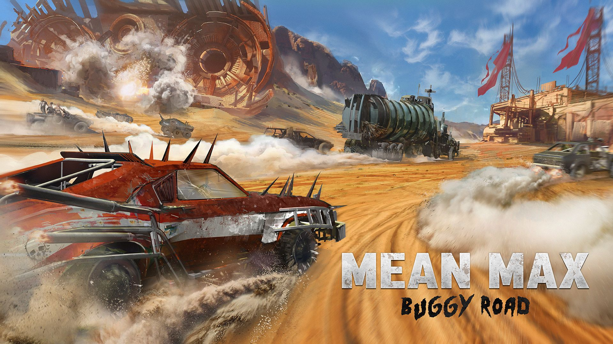
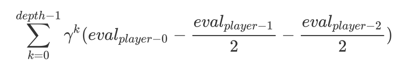
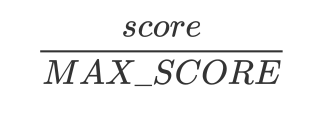
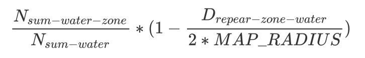
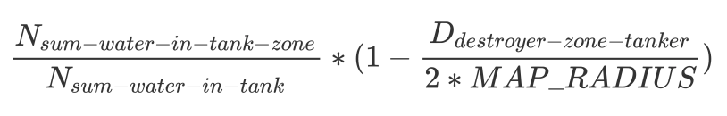
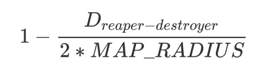
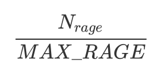

# Contest MeanMax - 15th / 2512 participants

My solution to the *CodinGame Community Contest 01 - MeanMax* which ended up 15th out of 2512 participants. The leaderboard is available . The goal was to develop the best agent possible in eight days.

## Acknowledgement & Game

Thanks a lot to the game creators : Magus, pb4, reCurse and Agade! This contest has been a lot fun! 

Also, congratulations to every participant who took part in the contest and more specifically to the top players. I have never seen a game where the level of the AI improved that fast in the last days! It was impressive!

## Search Algorithm

The search algorithm that I used is a Genetic Algorithm (GA). I tried a Monte Carlo (MC) at the beginning of the week but as my simulation was bugged, I can't conclude anything on the difference of performances between a GA and a MC.

Moreover, I used a single run to compute the actions of my three pods. It allows the cars to be aware of each other and then act as one. (Like when a grenade is launched by a car to speed up another one). 

My best solution was with a *population size* of 10 and a *depth* of 3.

## Evaluation

In order to score each chromosome of a population, I decided to compute a score each round in the future and sum them up with a delay. Also, I evaluated each of my opponents with the exact same function that I used to evaluate my move. In other words, it corresponds to the following formula :

  

The evaluation of a given player at a given turn is a linear interpolation of the following heuristics : 

### Score
The score because it is what we have to maximize.

  

### Distance to Wrecks
Fraction between the sum of the water available in Wrecks in a zone around a Wreck and the amount of water in all the Wrecks on the map. 

  

### Distance to Tankers
Fraction between the sum of the water available in Tankers in a zone around a Tanker and the amount of water in all the Tankers on the map. 

  

### Distance reaper - destroyer
I wanted to avoid destroying Tankers that I wasn't able to harvest, hence forcing the Reaper and the Destroyer to be close allowed to do it.

  

### Rage
Putting the rage in the evaluation allows to avoid wasting it and to increase the speed of the Doof (because it is what generates the ressource).

  

## Dummy

I decided to modelise the opponents with a *really* simple dummy that follows those rules : 
- The reaper moves to the closest non-empty Wreck with maximum speed. If the reaper is already havesting on a wreck then the power is equals to zero.
- The destroyer moves to the Tanker that is the closest to the reaper of the same player with maximum speed.
- The Doof moves to the reaper of the opponent with the closest score with maximum speed. The idea is that it is better to protect a second position than trying to block someone that has a lot more water than us.

## Tricks
- The best weights for the evaluation function have been computed using an offline training.
- The Genetic Algorithm allows to find smart moves but sometimes it fails miserably. Instead of putting only random actions in the search space, hardcoding a few actions (the heuristics used for the dummy actually) allows to always find at least better than those. This trick gives a significant boost.
- I did not have time to do any optimisation of the Referee. Thus, I only have 3000 simulations per turn. So no cache on collisions for example.

## Conclusion

Awesome contest! I learned a lot again! It is so sad I lost too much time debugging that I couldn't try new things.

Basically a lot of fun and many things learned! Thanks a lot to everyone involved in making this possible from creators, to participants!

See you for the next contest where I shall take my revenge! :) 
